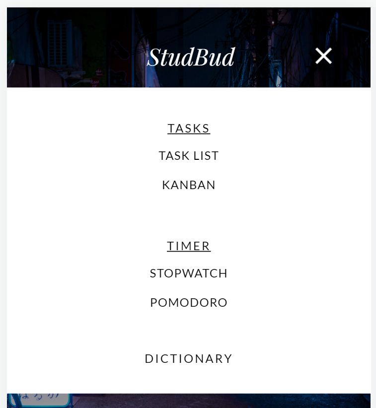

# StudBud

## Justification for Design Decisions

### Task List 

I decided to change the task list design from a table only format into a combination of a table format for task detail input, and a separate section beneath to list out the inputted tasks. This was done so that it is easier to view as the original design seemed to have an overwhelming amount of text displayed. By moving the inputted task into a separate box would allow finding specific tasks easier and less intimidating with a less crowded aesthetic. A delete task function was also added so users can delete tasks they no longer wish to display.

*Original mockup (top) Website prototype (bottom)*

 

### Kanban Board

The Kanban board design was altered slightly with the removable of the edit button which was intended for renaming columns. It was replaced by implementing user text input in the column headers so that users can directly change column names without having to click an extra button. The columns were redesigned with spaces in between for a more modern aesthetic. Finally, the add column button was moved to the top so that the position of the button wouldn’t keep changing as more columns are added.

*Original mockup (top) Website prototype (bottom)*

 

### Hamburger Navigation

The hamburger nav icon position was moved to the right to achieve a more consistent design and smoother transition from the desktop nav as the desktop nav is also on the right side. The updated version of the nav displays all components immediately without having to click through to see subcategories which helps save precious time in the lives of busy students. Overall, the new design employs a cleaner, more professional look, with greater contrast in text and background colour to improve readability.

*Original mockup (top) Website prototype (bottom)*